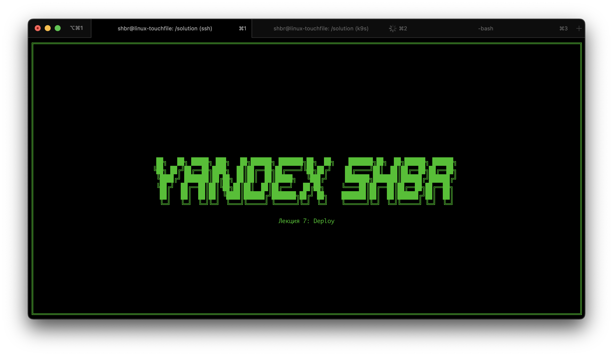
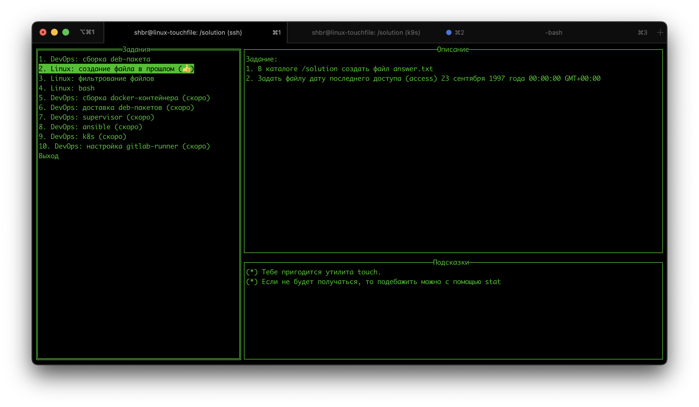
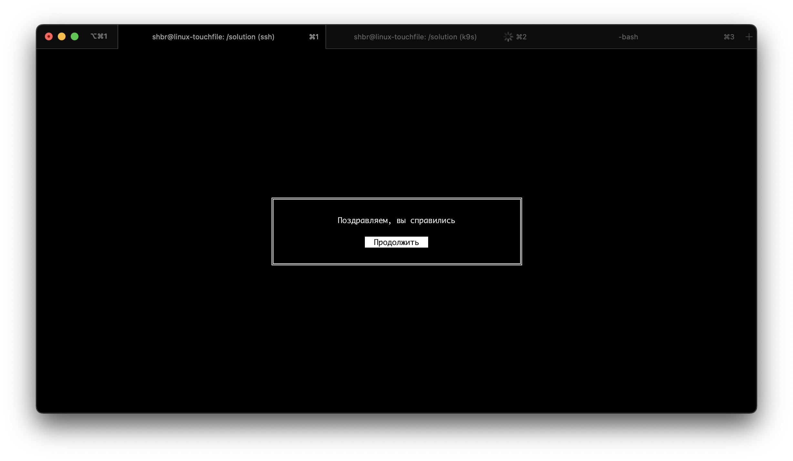
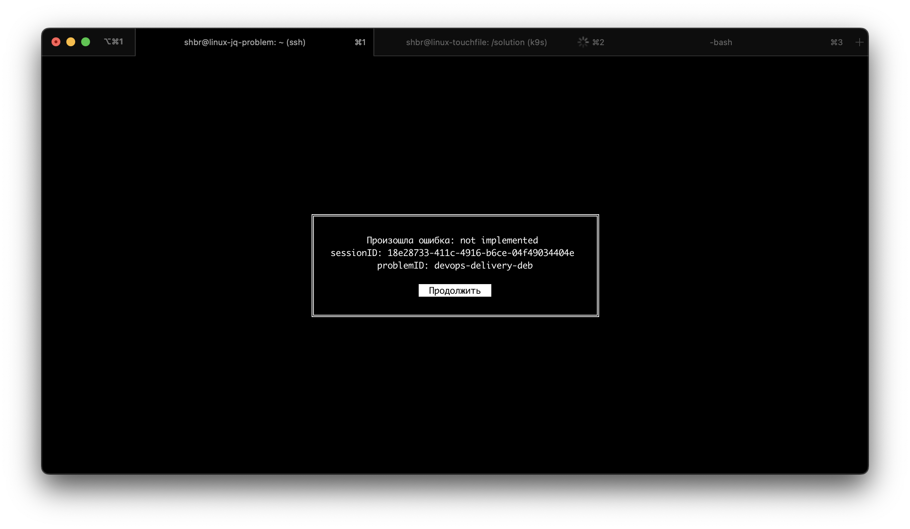

# Домашнее задание к лекции про Deploy

## tldr
```bash
ssh cgym.ozhegov.name
```

## Алгоритм
1. Подключиться с помощью терминала по ssh: `ssh cgym.ozhegov.name`
2. Если ты подключаешься первый раз, то необходимо пройти регистрацию
   * Перейти по ссылке, которая отобразится на экране. В современных терминалах можно зажать Ctrl или Cmd, тогда ссылка станет кликабельной
   * Тебя перебросит на gitlab, нужно разрешить использовать твой аккаунт
   * После этого произойдет перенаправление на https://cgym.ozhegov.name, должна отобразиться пустая страница со словом `welcome`. После этого страницу нужно закрыть.
   * Возвращайся в терминал, жмем Enter и переподключаемся
   * Если публичный ключ уже добавлен в gitlab, то откроется меню с выбором задачи, если нет, то нужно добавить публичный ключ [здесь](https://git.yandex-academy.ru/-/profile/keys)
3. Выбираем задачу
   * При выборе откроется либо консоль в некое окружение, в нем нужно выполнить задание, которое отображается в меню, либо форма для ввода ответов.
   * Проверка осуществляется в фоне автоматически, как только вы выполните условие, появится окно с сообщением об успехе
4. Рядом с решенными задачами будет отображаться 👍🏼

## Скриншоты






## F.A.Q.

### Q. Будет ли что-то ломаться?
Конечно! Проект в альфе, будем стараться оперативно чинить. О проблемах нужно сообщать в чатик, сообщив sessionID, problemID с экрана об ошибки и свой логин.
На каждого студента аллоцируется docker-контейнер, возможна ситуация, когда не хватит ресурсов на всех, постараемся от масштабироваться.

### Q. Не понятно условие задачи
Нужно писать в чатик, где обсуждаются ДЗ. Обсудим, подправим описание.

### Q. Я все сделал, а решение не принимается
Нужно писать в чатик, где обсуждаются ДЗ. Обсудим, если нужно, подправим задачу.

### Q. Консоль, ужас! Как мне писать файлы без моей любимой IDE?
Мы специально ставим тебя в реальные условия, в которых необходимо уметь эффективно работать. Тяжело в учении — чуть проще в бою!

### Q. Нужен root в окружении
Если задача предполагает запуск команды от root, это можно сделать через sudo.